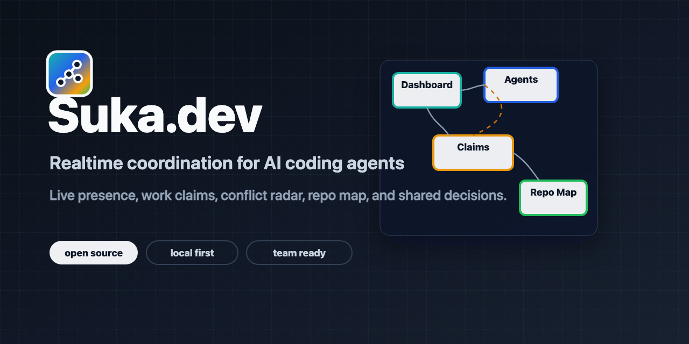
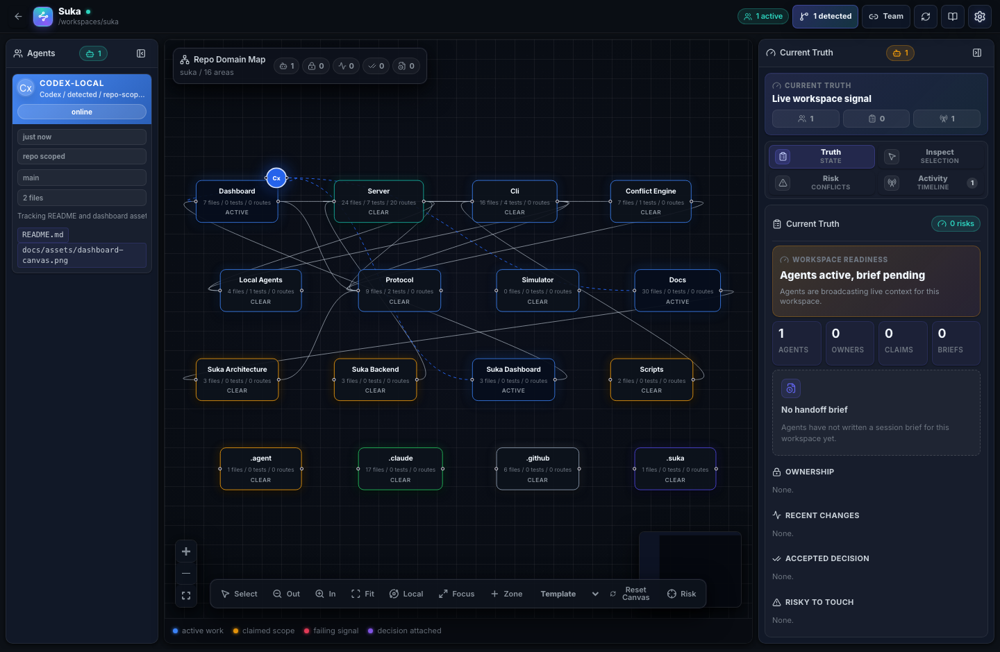

# Suka.dev

**Live handoff and coordination infrastructure for teams running multiple AI coding agents in the same codebase.**

[](https://github.com/whitechart-studio/Suka.dev/actions/workflows/pr-gate.yml)
[](https://github.com/whitechart-studio/Suka.dev/actions/workflows/main-ci-cd.yml)
[](https://github.com/whitechart-studio/Suka.dev/actions/workflows/codeql.yml)




Suka.dev is a local-first coordination layer for agentic software teams. It gives humans, Codex, Claude Code, and future coding agents a shared live room for presence, ownership boundaries, conflict signals, repository domains, handoff briefs, and accepted engineering decisions before parallel work collides.

It is not an AI code generator. It is the operating layer around your coding agents: worktrees isolate code; Suka coordinates context, ownership, and intent.

## Product Preview



The dashboard is designed around a mission-control canvas. Agents, repository domains, claims, briefs, risks, and accepted decisions are visible together. The top bar tracks the active repo, the canvas shows the repo domain map, and the Current Truth rail answers what the next agent needs to know before touching code.

## Why This Exists

AI-assisted engineering is becoming parallel. Codex may be editing a server route while Claude Code reviews the UI path that depends on it. Another agent may add tests, another may touch schema, and a human maintainer still needs to understand the operational state of the repository.

Git shows what changed after the fact. Chat explains intent to humans. Suka gives agents and developers structured coordination data while the work is happening.

## Current Workflow

1. Start Suka locally or self-host it for a team.
2. Open the dashboard and select a repository from the top `track repo` control.
3. Let Suka detect local Codex and Claude Code sessions that are scoped to that repo.
4. Publish explicit presence, claims, do-not-touch scopes, events, decisions, and handoff briefs from agents or scripts.
5. Use Current Truth before starting work: who is active, what is owned, what changed recently, what is risky, and what the next agent should do.

## What Suka Coordinates

| Signal | What it answers | Example |
| --- | --- | --- |
| Presence | Who is active right now? | `codex` is editing `apps/server/src/http.ts` |
| Claims | What work area is temporarily owned or blocked? | `apps/server/**` is claimed, `packages/protocol/**` is do-not-touch |
| Events | What just happened? | `POST /api/cleanup` contract changed |
| Conflicts | What work may collide? | API, path, domain, table, or env overlap |
| Decisions | What should future agents remember? | Cleanup must be scoped by workspace, repo, or session |
| Briefs | What should the next agent know? | Changed files, decisions, assumptions, risks, and next action |
| Projects | Which repo is Suka tracking? | `/Users/team/work/suka` is the active local workspace |
| Zones | How should the canvas be organized? | A user-created handoff zone groups backend risk and owner notes |

Claims are advisory, not locks. Suka warns about risk without taking control away from developers.

## Core Capabilities

- Realtime operations canvas for active agents, repo domains, claims, events, briefs, decisions, and risk signals.
- Topbar repo tracking with recent folders, native folder selection, and live local-agent detection.
- Current Truth rail for readiness, handoff briefs, ownership, recent changes, accepted decisions, and risky-to-touch areas.
- Custom canvas zones so teams can organize the map around their own mental model.
- Typed protocol for presence, claims, events, decisions, briefs, and project configuration.
- Deterministic conflict engine for paths, APIs, domains, tables, and environment keys.
- Local HTTP/WebSocket server with in-memory or file-backed persistence.
- CLI for serving, publishing, checking conflicts, writing briefs, reminders, releasing claims, and scoped cleanup.
- Scoped coordination context with `workspace_id`, `repo_id`, and `session_id`.
- Local detection adapters for repo-scoped Codex and Claude Code activity.
- Self-hostable foundation with Docker and CI gates.
- Privacy-first posture: metadata over prompts, transcripts, code content, or raw terminal logs.

## Quickstart

Requirements:

- Node.js `>=20.11`
- npm `>=10`

```bash
git clone git@github.com:whitechart-studio/Suka.dev.git
cd Suka.dev
npm install
npm run build
node apps/server/dist/bin.js
```

Open:

```text
http://127.0.0.1:4366
```

In the dashboard, use `track repo` in the top bar to select the repository you want Suka to watch. The UI supports a native folder picker where the local bridge is available, recent folders, and a manual path fallback.

Run the verification gate:

```bash
npm run ci:verify
```

Check local Suka readiness:

```bash
node packages/cli/dist/bin.js doctor \
  --server http://127.0.0.1:4366
```

Start a shared agent session:

```bash
node packages/cli/dist/bin.js session start \
  --server http://127.0.0.1:4366 \
  --repo whitechart-studio/Suka.dev \
  --agent codex-local \
  --env-file .suka/session.env
```

The env file is local runtime state. Source it in each agent shell before running `session join`.

Join the session from an agent:

```bash
node packages/cli/dist/bin.js session join \
  --server http://127.0.0.1:4366 \
  --workspace local-whitechart-studio-suka-dev \
  --repo-id whitechart-studio-suka-dev \
  --session session-20260614102030 \
  --agent codex-local \
  --task "Build session workflow"
```

Inspect the active session:

```bash
node packages/cli/dist/bin.js session status \
  --server http://127.0.0.1:4366 \
  --workspace local-whitechart-studio-suka-dev \
  --repo-id whitechart-studio-suka-dev \
  --session session-20260614102030
```

End a scoped session safely:

```bash
node packages/cli/dist/bin.js session end \
  --server http://127.0.0.1:4366 \
  --workspace local-whitechart-studio-suka-dev \
  --repo-id whitechart-studio-suka-dev \
  --session session-20260614102030
```

## CLI Examples

Detect Codex and Claude Code sessions running in the same local repo:

```bash
node packages/cli/dist/bin.js agents detect \
  --server http://127.0.0.1:4366 \
  --publish
```

Keep detected local agents visible while both tools are working in that repo:

```bash
node packages/cli/dist/bin.js agents watch \
  --server http://127.0.0.1:4366 \
  --workspace local-whitechart-studio-suka-dev \
  --repo-id whitechart-studio-suka-dev \
  --session session-20260614102030 \
  --interval 15 \
  --ttl 45
```

Detection is a convenience layer. Suka can infer that Codex or Claude Code is running from the repository working directory, but file ownership and intent are strongest when agents also publish explicit presence, claims, events, and briefs.

Publish live presence:

```bash
node packages/cli/dist/bin.js presence \
  --server http://127.0.0.1:4366 \
  --agent codex-local \
  --tool codex \
  --repo whitechart-studio/Suka.dev \
  --status editing \
  --task "Implement cleanup API" \
  --file apps/server/src/http.ts
```

Claim a work area:

```bash
node packages/cli/dist/bin.js claim "apps/server/**" \
  --server http://127.0.0.1:4366 \
  --agent codex-local \
  --reason "Own cleanup and realtime state updates"
```

Block a do-not-touch area while focused work is in progress:

```bash
node packages/cli/dist/bin.js block "packages/protocol/**" \
  --server http://127.0.0.1:4366 \
  --agent codex-local \
  --reason "Do not edit protocol types during validator changes"
```

Check for conflicts:

```bash
node packages/cli/dist/bin.js conflicts \
  --server http://127.0.0.1:4366 \
  --agent claude-code-local \
  --path apps/server/src/http.ts \
  --api "POST /api/cleanup"
```

Check changed files for missing shared-truth updates:

```bash
node packages/cli/dist/bin.js remind \
  --server http://127.0.0.1:4366 \
  --changed
```

Write a session handoff:

```bash
node packages/cli/dist/bin.js brief write "Finished scoped cleanup API" \
  --server http://127.0.0.1:4366 \
  --changed \
  --next "Review dashboard Current Truth panel"
```

Read the latest handoff for the current session:

```bash
node packages/cli/dist/bin.js brief read \
  --server http://127.0.0.1:4366 \
  --session current
```

View the connected team:

```bash
node packages/cli/dist/bin.js team \
  --server http://127.0.0.1:4366
```

Clean a scoped session safely:

```bash
node packages/cli/dist/bin.js cleanup \
  --server http://127.0.0.1:4366 \
  --workspace local-regression \
  --repo multi-agent-regression \
  --session reg-20260613151655
```

Cleanup requires at least one scope flag. There is no empty “wipe everything” cleanup path.

## Architecture

```text
AI agents / developers
        |
        v
CLI, MCP, or HTTP clients
        |
        v
Suka server
        |
        +-- protocol validation
        +-- scoped persistence
        +-- conflict engine
        +-- WebSocket broadcasts
        +-- dashboard canvas
```

Packages:

| Package | Purpose |
| --- | --- |
| `@suka/protocol` | Pointer types, config types, validators |
| `@suka/conflict-engine` | Deterministic conflict checks |
| `@suka/server` | HTTP API, WebSocket realtime, persistence, cleanup |
| `@suka/cli` | Developer and agent command-line interface |
| `@suka/local-agents` | Repo-scoped local process detection |
| `@suka/dashboard` | Operations canvas, Current Truth rail, project tracking UI |

## Privacy Model

Suka is designed to coordinate repository work without becoming a prompt archive.

By default, Suka stores structured metadata:

- agent identity and tool name
- task summaries
- paths, APIs, tables, env key names, and domains
- conflict warnings
- accepted decisions and evidence references

Suka should not store:

- private prompts
- chain-of-thought
- raw terminal logs
- source code content
- secrets or secret values

## Platform Direction

Suka is being built for:

- local-first development
- self-hosted team deployments
- future hosted workspaces
- Windows, Linux, and macOS developer workflows
- Linux containers for production self-hosting
- responsive dashboard access from tablets and mobile browsers

## Project Status

Suka.dev is pre-release infrastructure. The protocol, conflict engine, server, CLI, dashboard, local-agent detection, project tracking, PR gates, and scoped cleanup foundation are in active development.

No stable release is available yet.

## Documentation

- [Getting Started](docs/wiki/Getting-Started.md)
- [Architecture](docs/wiki/Architecture.md)
- [Dashboard](docs/wiki/Dashboard.md)
- [CLI and Agent Pointers](docs/wiki/CLI-and-Agent-Pointers.md)
- [Security and Privacy](docs/wiki/Security-and-Privacy.md)
- [Self-Hosting](docs/wiki/Self-Hosting.md)
- [Agent Coordination Workflow](docs/engineering/agent-workflow.md)
- [PR Gate](docs/engineering/pr-gate.md)
- [Project Hygiene](docs/engineering/project-hygiene.md)
- [Package Manager Strategy](docs/architecture/0006-package-manager-strategy.md)
- [Social Preview](docs/open-source/social-preview.md)

## Contributing

Suka is intended to become a serious open-source infrastructure project. Contributions should keep the protocol tight, preserve privacy defaults, and include tests for changed behavior.

Before opening a PR:

```bash
npm run ci:verify
```

Useful contribution areas:

- agent integrations
- MCP tooling
- conflict detection rules
- dashboard interaction design
- self-hosted deployment hardening
- documentation and examples

## Brand Assets

Repository social preview:

- Source: [docs/assets/social-preview.svg](docs/assets/social-preview.svg)
- PNG: [docs/assets/social-preview.png](docs/assets/social-preview.png)

Dashboard screenshot:

- [docs/assets/dashboard-canvas.png](docs/assets/dashboard-canvas.png)

## License

License selection is pending while the project is pre-release.
